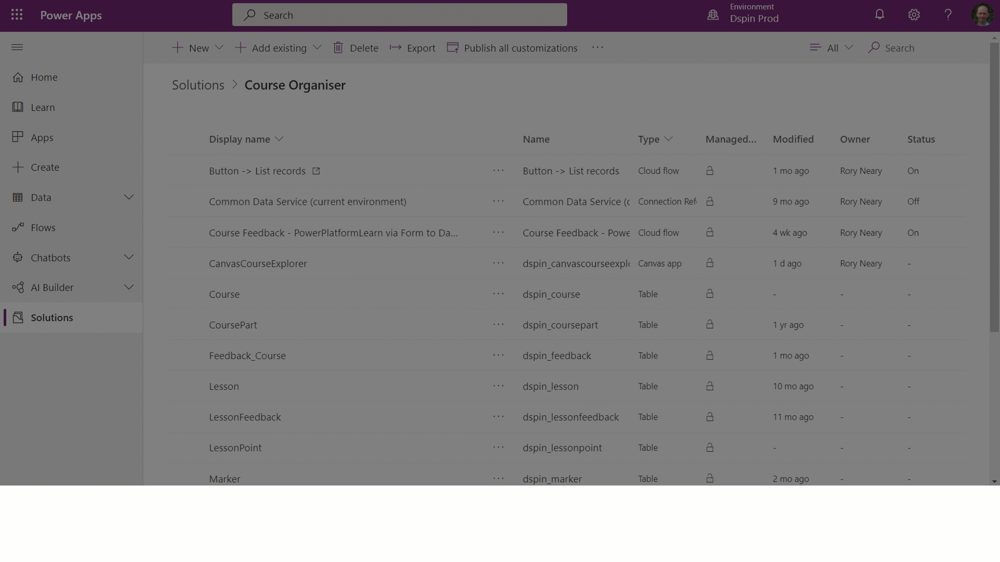

# What are model-driven apps in Power Apps?

## Model-driven apps in brief

Model-driven app design is an approach that focuses on adding components such as [forms](../model-driven-apps/model-driven-app-glossary.md#Form), [views](../model-driven-apps/model-driven-app-glossary.md#View), and [charts](../model-driven-apps/model-driven-app-glossary.md#Chart) and [dashboards](../model-driven-apps/model-driven-app-glossary.md#Dashboard) to your apps using an app designer tool. With little or no code, you can build apps that are simple or very complex.

Whilst we call them model-driven apps it is often easier to think of them as [data model](../model-driven-apps/model-driven-app-glossary.md#data-model) driven apps as without a data model housed within Microsoft Dataverse they cannot be created.

From the perspective of users all model-driven apps offer a very similar user experience, similar to the diagram shown below.  

In this case we have one [dashboard](../model-driven-apps/model-driven-app-glossary.md#Dashboard), containing multiple [charts](../model-driven-apps/model-driven-app-glossary.md#Chart) and [views](../model-driven-apps/model-driven-app-glossary.md#View) in addition to being able to see 3 [tables](../model-driven-apps/model-driven-app-glossary.md#table).  We can navigate between the tables using the menus on the left hand side or via the [dashboard](../model-driven-apps/model-driven-app-glossary.md#Dashboard).

:::image type="content" source="media/model-driven-app-overview/model-app-sample.png" alt-text="Sample model-driven app":::

## Benefits of the model-driven approach

Unlike [canvas app](../model-driven-apps/model-driven-app-glossary.md#canvas-app) development where the designer has complete control over app layout, with model-driven apps much of the user interface is determined for you and is largely designated by the [components](../model-driven-apps/model-driven-app-glossary.md#Component) you add to the app.

There are some notable advantages to this method of application development.  

- Once the [data model](../model-driven-apps/model-driven-app-glossary.md#data-model) and [relationships](../model-driven-apps/model-driven-app-glossary.md#Relationship) have been created the build process is **relatively rapid** due to rich component-focused no-code design environments
- Apps have a **similar user interface** across a variety of devices from desktop to mobile
- The apps are [**accessible**](../model-driven-apps/model-driven-app-glossary.md#Accessibility) and [**responsive**](../model-driven-apps/model-driven-app-glossary.md#Accessibility) automatically
- The user experience is **consistent** across all model-driven apps.  As such once a user is confident with one model-driven app later apps are much easier to adopt within an organization.
- Migrating apps between Development, Test and Production [Environments](../model-driven-apps/model-driven-app-glossary.md#environment) is relatively straightforward through the use of [solutions](../model-driven-apps/model-driven-app-glossary.md#solution)

## Model-driven and canvas apps compared

In canvas apps, the app maker has total control over the app layout. In model-driven apps, on the other hand, much of the layout is determined by the components you add. The emphasis is more on quickly viewing your business data and making decisions instead of on intricate app design.

|Category|Model-driven apps|Canvas Apps|  
|-----------|------------|------------|
|**Data integration**|Microsoft Dataverse only|Microsoft Dataverse + many others using connectors|
|**Design Experience**|No-code component focused design|Manipulation of control properties using Power Fx expressions|
|**UI control**|Limited, predominantly customisation|Full control|
|**App consistency**|High – differs predominantly based on the tables and views chosen|Often low, given the significant control the designers have of the user experience|
|**Migration between environments**|Simple|Potentially complex given that the datasources may need to be updated|
|**Speed of creation**|Rapid|Relative to the complexity of the design|
|**Responsive**|Automatically responsive|Only responsive if designed in this way|
|**Navigation through relationships**|Automatic, provided relationships exist|Only where designed and applied using Power Fx formulas|
|**Accessibility features**|Built in|Only if designed into the app|

## Steps to building and sharing a model driven app

At a fundamental level, model-driven app making consists of the following areas.

- Modeling business data
- Defining business processes
- Composing the app
- Configuring security roles
- Sharing your app

### Modeling business data

To model business data you determine what data your app will need and how that data will relate to other data. Model-driven design uses a metadata-driven architecture so that designers can customize the application without writing code. Metadata means “data about data” and it defines the structure of the data stored in the system. [Tutorial: Create a custom table that has components in Power Apps](../data-platform/create-custom-entity.md)

### Defining business processes

Defining and enforcing consistent business processes is an important aspect of model-driven app design, however it should be noted that it is possible to create a model-app **without** a business process configured around it.

Nevertheless, consistent processes help make sure your app users focus on their work and not on remembering to perform a set of manual steps. These processes can be simple or complex and can contain operations on multiple tables.

The screenshot below illustrates the impact of having a business process flow in place.

:::image type="content" source="../../user/media/business-process.png" alt-text="Sample model-driven app":::

Business process flows are created and configured using Power Automate.  

More information: [Business process flows overview](/flow/business-process-flows-overview) and [Apply business logic with Microsoft Dataverse](../data-platform/processes.md).

### Composing the model-driven app

After creating your data model and defining business processes where necessary, you can begin to build your app.

This consists of a number of broad stages.

- Create the app
- Configure the navigation experience using the site map
- Play your app

Much of the time is spent configuring the site map, as this defines the navigation experience for the users.

Once these stages are complete you can move onto the final phases associated with distributing your app.

### Configuring security roles

Access to tables is defined using roles and these roles define the actions that users can perform with the tables within Dataverse. Without this users will have no meaningful access to the app.

These actions cover Create, Read, Write, Delete, Append, Append To, Assign and Share.  Roles need to be first configured and then users are assigned to roles at the point of sharing.

For more information on understanding, creating and configuring security roles see the following:

- [Power Platform documentation](https://docs.microsoft.com/en-us/power-platform/admin/security-roles-privileges)
- [Microsoft Learn module](https://docs.microsoft.com/en-us/learn/modules/get-started-security-roles/)

### Sharing your app

To share an app you need 2 actions are required.

- Assign the user a security role.  This means that they have permission to see the data.

:::image type="content" source="media/share-model-driven-app/share-app.png" alt-text="Sample model-driven app":::

- Share a link to the app.  To get the link :

1. Edit the app and click the **Properties** tab
2. Copy the **Unified Interface URL.**
3. Paste the app URL in a location so that your users can access it, such as by posting it on a SharePoint site or send via email.

## Using solutions to assist with Application Lifecycle Management

[Application lifecycle management](../model-driven-apps/model-driven-app-glossary.md#application-lifecycle-management) is the way in which we develop an app from conception to end of life.

[Solutions](../model-driven-apps/model-driven-app-glossary.md#solution) are used to act as wrappers for all the elements required to deliver a product for use within a business.

As a minimum a model driven app requires a single table, a site map plus the app itself however they generally include an considerable amount more, and this includes canvas apps, roles, environment variables and much more.  

:::image type="content" source="../../maker/model-driven-apps/media/solution-assets-explorer.png" alt-text="Sample model-driven app":::

Solutions offer the means by which these elements can be migrated between environments.  Consequently, they are an important part of any application lifecycle management strategy.

It is regarded as best practice when creating model-driven apps that these are done so within a solution.

[Learn more about solutions](../../developer/data-platform/introduction-solutions)

[Create a solution](../../maker/data-platform/create-solution)

## Next steps

[Building a simple model-driven app](build-first-model-driven-app.md) is a great way to start.  You may wish to [Create a solution](../../maker/data-platform/create-solution) before you do so.

If you are new to Power Apps, and want to learn about how to convert your ideas into a fully working solution using Power Apps, start with [Planning a Power Apps project](../../guidance/planning/introduction.md).

[Understand model-driven app components](model-driven-app-components.md) will help you to understand some of the elements that make up a model-driven app.

[!INCLUDE[footer-include](../../includes/footer-banner.md)]